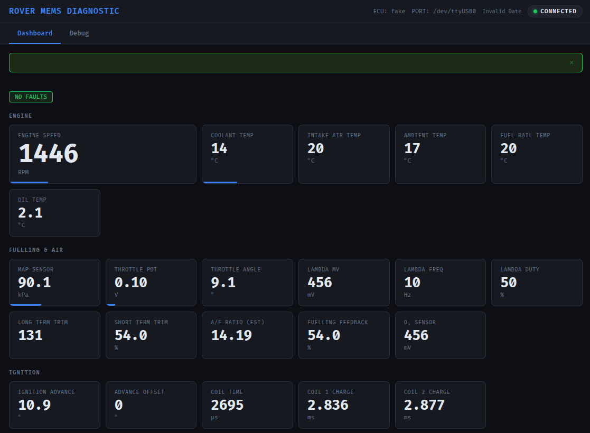
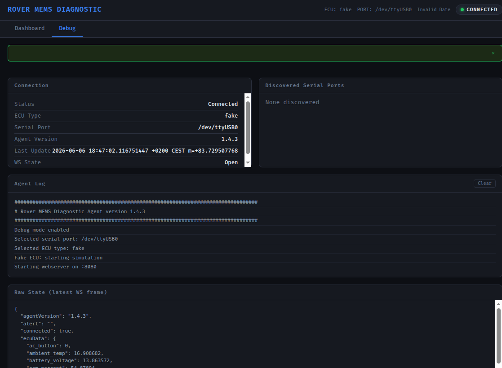

# rover-mems-ecu

Application to communicate with Rover MEMS ECUs over a K-line / serial interface.
Written in Go, it runs as an HTTP/WebSocket API and serves an embedded dashboard,
so it works standalone without internet access.

Supported ECU types (`-ecutype`): `1.x` (MEMS 1.2 / 1.3 / 1.6), `1.9`, `2J`, `3`,
`rc5` (airbag), and `fake` (for testing without hardware).

## Credit / original work

This is a fork of James Portman's **rover-mems-agent**:
https://github.com/james-portman/rover-mems-agent

All of the protocol reverse-engineering and the original ECU handlers are his work.
The reference protocol documentation lives at https://rovermems.com/ and
https://github.com/james-portman/rover-mems-documentation.

## What this fork changes over the original

- **Standard Go project layout** — reorganised into `cmd/`, `internal/`, `pkg/`
  instead of a flat package.
- **ECU interface + registry/factory pattern** — every ECU type implements a common
  `ECU` interface and self-registers, so adding or selecting a variant is decoupled
  from the main loop.
- **Wider ECU coverage** — added the MEMS 1.x family (1.2 / 1.3 / 1.6), the RC5 airbag
  ECU, and a `fake` ECU that produces data without any hardware attached.
- **MEMS 1.x / 1.9 parsing fixes** — corrected throttle-pot voltage scaling (0.02 V/LSB),
  the idle-switch bit mask (bit 4), and ignition-advance conversion (0.5°/LSB with the
  −24° offset, no longer truncated by integer division).
- **Embedded dashboard** — the web UI is bundled via `go:embed`, so the agent runs
  fully standalone.
- **Cross-compiled CI builds** for linux arm64 / amd64.

## Build & run

```bash
go build -o rover-mems-agent ./...
./rover-mems-agent -serialport /dev/ttyUSB0 -ecutype 1.9 -mode debug
```

| Flag          | Values                                 | Description                            |
| ------------- | -------------------------------------- | -------------------------------------- |
| `-serialport` | e.g. `/dev/ttyUSB0`                    | Serial port (auto-detected if omitted) |
| `-ecutype`    | `1.x`, `1.9`, `2J`, `3`, `rc5`, `fake` | ECU variant                            |
| `-mode`       | `prod` (default), `debug`              | `debug` enables byte-level logging     |

### Testing & linting

CI runs the unit tests and `golangci-lint` on every push and pull request. Run
the same checks locally before pushing:

```bash
# Unit tests (same flags as CI)
go test -race -shuffle=on ./...

# Static analysis
go vet ./...

# Linter — install once, pinned to the version CI uses (v1.64.8):
go install github.com/golangci/golangci-lint/cmd/golangci-lint@v1.64.8
golangci-lint run
```

> The pin matters: `golangci-lint` v2 uses an incompatible config format and
> will reject the v1-style `.golangci.yml` in this repo.

### ARM builds

Cross-compiling for ARM (e.g. Raspberry Pi) requires the pinned serial library
version `github.com/distributed/sers v1.1.0-rc1.0.20220718092729-b7631e8356ee`
(already set in `go.mod`); the tagged release does not build on ARM.
See https://github.com/distributed/sers/issues/10.

```bash
GOOS=linux GOARCH=arm64 go build -o rover-mems-linux-arm64 ./...
```


### Screenshots

| Main tab                              | Debug tab                                    |
| ------------------------------------- | -------------------------------------------- |
|  |  |


## Disclaimer

THIS IS NOT RELATED TO OR ASSOCIATED WITH ROVER (the company, or any parent company
or owner) IN ANY WAY.

It is intended to help people repair their own cars. There is no intent to make any
profit or benefit from this in any way.

Please use the GitHub Issue / Pull Request / Discussion options to get in touch.
